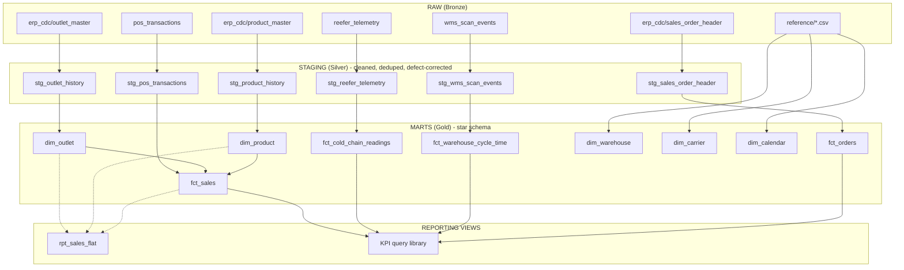

# Kestrel Provisions — Analytical Foundation

## Prerequisites
- Python 3.x (conda environment recommended)
- Dependencies: duckdb, pyarrow, numpy, pandas

## Setup
1. Create and activate a Python environment (conda or venv)
2. Install dependencies:
   pip install duckdb pyarrow numpy pandas
3. Generate the raw dataset (not committed to this repo):
   python3 generate_dataset.py --scale 1 --out data
4. [pipeline run command — added in a later step]

## Repository structure
(to be filled in as the pipeline is built)

## Architecture

Medallion-style layered pipeline: raw -> staging -> marts, with reporting views on top.

**Design principles:**
- Each staging table maps to exactly one raw source; defect-specific fixes (L1-L18) are documented as inline comments in the corresponding staging SQL scripts, not duplicated here
- Fact tables reference dimensions by key; joins happen at query time, not pre-baked into storage
- dim_outlet/dim_product are point-in-time (versioned), so historical reporting reflects attributes *as of* the event date, not today's values
- Reporting views (dashed lines) are convenience layers on top of the star schema - always in sync, never a separate source of truth
