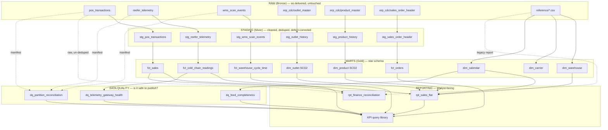

# Kestrel Provisions — Analytical Foundation

A defined, documented, queryable set of numbers for a food and grocery
distributor, built from four source systems that do not agree with each other.

- **[`DECISIONS.md`](DECISIONS.md)** — what was built, what was not, and why. Read this first.
- **[`docs/kpi_catalogue.md`](docs/kpi_catalogue.md)** — every metric, defined. The artefact the CFO asked for.
- **[`sql/queries/`](sql/queries/README.md)** — the runnable SQL behind every metric.
- **`python3 scripts/ask.py "your question"`** — ask in plain English; it shows the SQL.
- **[`docs/findings.md`](docs/findings.md)** — the data-quality investigation in full.

---

## Cold start

Assumes a clean machine with Python 3.9+ and nothing else.

```bash
# 1. Environment
python3 -m venv .venv && source .venv/bin/activate
pip install duckdb pyarrow numpy pandas

# 2. Generate the raw dataset (~10.3m rows, not committed to this repo)
python3 generate_dataset.py --scale 1 --out data

# 3. Build the warehouse
python3 scripts/run_pipeline.py

# 4. Ask it something, in plain English
python3 scripts/ask.py "gross sales by channel last quarter"
```

Step 2 takes a few minutes and writes ~1.5 GB. Step 3 builds 20 models in
one pass. Nothing else is required — no cluster, no
services, no configuration file.

The dataset is regenerated rather than committed, per the assignment brief.
The seed is fixed, so two runs at the same scale produce identical bytes.

---

## Running it

### Build the whole thing

```bash
python3 scripts/run_pipeline.py
```

Prints a row count and timing per model. Every model is `CREATE OR REPLACE`,
so the run is idempotent — re-run it as often as you like, there is no
incremental state to corrupt and nothing to clean up after a failure.

| Option | Purpose |
|---|---|
| `--data-root DIR` | Where `raw/` and `reference/` live. Default `data` |
| `--db FILE` | Database to build into. Default `kestrel.duckdb` |
| `--layer {staging,marts,dq,reporting}` | Build one layer instead of all four |
| `--threads N` | Cap DuckDB worker threads. Useful on a small machine at higher scale |
| `--fail-fast` | Stop at the first failing model instead of continuing |

`KESTREL_DATA_ROOT` and `KESTREL_DB` work as environment-variable equivalents.

### Run at ten times the volume

```bash
python3 generate_dataset.py --scale 10 --out data_10x
python3 scripts/run_pipeline.py --data-root data_10x --db kestrel_10x.duckdb
```

No SQL changes required — data paths are injected as a DuckDB variable, not
hardcoded in the models. See `DECISIONS.md` for what we expect to break first
and at what volume.

### Ask it a question

```bash
python3 scripts/ask.py "gross sales by channel last quarter"
python3 scripts/ask.py "units sold in eaches last month"
python3 scripts/ask.py                                   # interactive
python3 scripts/ask.py "..." --dry-run                   # show the plan and SQL only
```

Prints the metric it matched, its catalogue ID, the period it resolved, the
**SQL it is about to run**, and a copy-pasteable command to reproduce the
result — then the answer. This is the CFO's requirement: *"if it cannot show me
the query it ran, I am not interested."*

It routes to queries that already exist; it does not write SQL, so it cannot
return a number nobody defined. Two behaviours worth knowing:

- **Questions that sound answerable but are not** — cycle time by warehouse,
  excursion rate by carrier, outlet channel changes — return the documented
  reason and a runnable proof instead of a figure.
- **Relative dates anchor to the latest date in the data**, not today's clock.
  The shipped dataset ends 2026-06-30, so "last month" means June 2026.
  Anchoring to the wall clock would return nothing and look like a broken
  pipeline rather than a stale feed.

The vocabulary it understands is data, not code:
[`sql/queries/intents.json`](sql/queries/intents.json). Adding a question means
adding an entry there.

### Query it directly

```bash
python3 scripts/run_query.py --list                    # what's available
python3 scripts/run_query.py <path/to/query.sql>       # run one
python3 scripts/run_query.py <path> -p date_from=2025-04-01 -p group_by=channel
```

Parameters are declared with `SET VARIABLE` at the top of each query file and
can be overridden on the command line without editing the file. Full index and
conventions: [`sql/queries/README.md`](sql/queries/README.md).

For ad-hoc work, connect directly:

```python
import duckdb
con = duckdb.connect("kestrel.duckdb")
con.sql("SELECT * FROM rpt_sales_flat LIMIT 5").show()
```

---

## Repository structure

```
├── scripts/
│   ├── run_pipeline.py            Build the warehouse. The documented entry point
│   ├── run_query.py               Run a query from the library, with parameters
│   └── ask.py                     Plain-English question -> the SQL, then the answer
├── sql/
│   ├── staging/                   6 models — one per raw feed, cleaned and deduped
│   ├── marts/                     9 models — star schema, 4 facts + 5 dimensions
│   ├── dq/                        3 models — completeness at three grains
│   ├── reporting/                 2 models — flat sales view, Finance reconciliation
│   └── queries/                   The KPI query library, organised by domain
│       └── intents.json           What ask.py understands. Data, not code
├── docs/
│   ├── kpi_catalogue.md           Every metric: definition, grain, owner, limitations
│   ├── findings.md                The data-quality investigation, feed by feed
│   └── assignment/                The original brief, unmodified
├── data/
│   ├── raw/                       Generated, gitignored. Four feeds, partitioned Parquet
│   ├── reference/                 Committed. UOM, warehouse, carrier, calendar, legacy report
│   └── _manifest/                 Committed. Expected partition and row counts
├── generate_dataset.py            The supplied generator. Produces everything in data/raw/
├── DECISIONS.md                   What was built, what was not, and why
└── README.md
```

Defect-specific handling (`L1`–`L18`) is documented as inline comments in the
staging model that fixes it, not duplicated into prose. The SQL and its
rationale stay in the same file, so neither can drift from the other.

---

## Architecture

Medallion-style layered pipeline: raw → staging → marts → dq → reporting.



`dim_carrier` is built and conformed but joins to no fact: there is no carrier
key anywhere in the source data. That is a finding, not an omission — see
catalogue entry X-01.

**Design principles**

- **One staging model per raw feed.** Defect fixes live where the defect is
  handled, as inline comments, so the fix and its justification cannot drift
  apart.
- **Facts reference dimensions by key; joins happen at query time.** No
  pre-joined storage, no duplication.
- **Outlet and product are SCD2**, so historical reporting reflects attributes
  *as of* the event date rather than today's values. `rpt_sales_flat`
  encapsulates that point-in-time join once, correctly, because the failure
  mode of getting it wrong is silent revenue inflation.
- **Reporting is a view where it can be**, so it is always in sync and never a
  second source of truth. `rpt_finance_reconciliation` is materialised only
  because it must re-read the raw un-deduplicated feed.
- **Metrics that cannot be built honestly are not built.** They are documented
  with evidence in the catalogue, and `sql/queries/limitations/` holds runnable
  proofs.
- **Completeness is checked at three grains, not one.** Manifest reconciliation
  catches short partitions, a calendar spine catches absent days, and
  per-dimension baselines catch holes inside a feed that looks healthy in
  total. Each catches a class of failure the other two structurally cannot
  see.

---

## What the numbers say

Three results worth knowing before reading anything else. All three are
reproducible from the query library.

**The legacy Finance weekly report cannot be reconciled to.** Supply Chain
alleged for eighteen months that it double counts and books sales on the wrong
day. Both allegations are confirmed real — and together they account for just
**+2.1%** of the gap. Reproducing both bugs exactly still lands ₹562 cr against
a published ₹459 cr, with a correlation of **0.0055** across 312 week × channel
cells. The published figures are not a buggy derivation of the POS feed; they
are not derived from it at all. Recommendation: replace, do not reconcile.
→ `sql/queries/finance/reconciliation_summary.sql`

**The cold chain excursion rate is 7.19%, not the ~33% Operations feared.** It
is also stable month to month with no seasonality. The ~33% figure appears to
come from an uncontrolled definition — a naive vehicle-day rollup gives 75.07%.
Separately, readings *below* the band are 2.75× more common than readings above
it (19.83% vs 7.19%), and the feed contract's definition of an excursion
excludes them. That definition needs a decision from Operations.
→ `sql/queries/cold_chain/excursion_rate_by_month.sql`

**A feed can be missing data and still look completely healthy.** The GW-017
gateway outage sits at ~95% of feed-level daily volume — comfortably normal —
because one dead gateway is 2.5% of telemetry. Feed-level monitoring never sees
it; a per-gateway baseline isolates both days with zero false positives across
21,294 gateway-days. Nor can feed-level thresholds be tuned to compensate: the
truncated-file day lands at 85.0% of median while the quietest *ordinary* day on
another feed is 85.9%. That is why completeness is checked at three grains
rather than one.
→ `sql/queries/data_quality/feed_completeness.sql`

**Three of the brief's eight illustrative questions cannot be answered from
these feeds.** Cycle time by warehouse, excursion rate by carrier, and outlet
channel reclassification are each blocked by a specific, demonstrable absence
in the source — not by anything this pipeline does. Each has a runnable proof
in `sql/queries/limitations/`.

---

## Requirements

`duckdb`, `pyarrow`, `numpy`, `pandas`. The DuckDB CLI is optional and is not
installed by `pip install duckdb`; `scripts/run_query.py` covers the same
ground without it.

Built and tested on DuckDB 1.5.5, Python 3.13, macOS.
